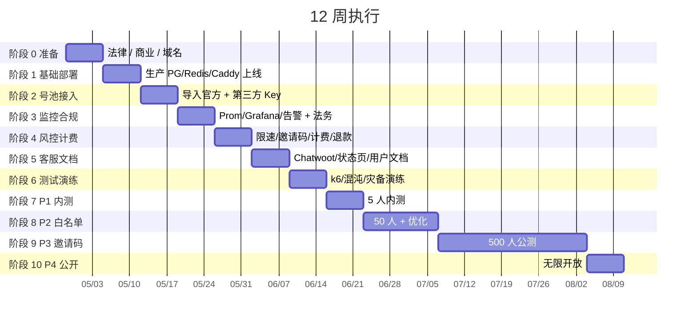

# 12 周执行路线图

> 把 [`/Users/kevin/AITRANSFER/new-api/`](../) 当前**本地 SQLite + root/123456** 的状态，按周推进到 **P4 公开运营**。

## 路线全景



**总周期**：约 12 周到 P4，可根据团队规模与风险偏好压缩或拉长。
**单人能撑到 P3**；P4 需要至少 1 个客服 + 1 个 SRE。

---

## Week 0 — 准备（开干前）

> 这周不写代码，做"上线前提"。错过这周后患无穷。

### 任务

| # | 任务 | 文件参考 | 完成判定 |
|---|---|---|---|
| 0.1 | 想清楚做不做（法律风险） | [`legal/`](./legal/) | 已读 ToS/AUP，能接受风险 |
| 0.2 | 注册公司 / 工作室主体 | — | 拿到营业执照 |
| 0.3 | 注册 ≥ 3 个不同后缀域名 | [`multi-region/dns-config.md`](./multi-region/dns-config.md) | example.com / .io / .app |
| 0.4 | 开 Cloudflare 账户 + 接管域名 DNS | [`multi-region/dns-config.md`](./multi-region/dns-config.md) | 域名解析在 cf 生效 |
| 0.5 | 买 1 台海外 Linux VPS（4C/8G+） | — | 能 SSH 上去 |
| 0.6 | 准备至少 1 张能跑国际 SaaS 的虚拟卡 | [`upstream/payment/vendor-list.md`](./upstream/payment/vendor-list.md) | OneKey / Wildcard / Bybit |
| 0.7 | 充值至少 $200（OpenAI / Claude 中之一） | — | 拿到 ≥ 1 个 sk- |
| 0.8 | 开 Telegram Bot + 记 chat_id | [`monitoring/alertmanager.yml`](./monitoring/alertmanager.yml) | bot 能在群里发消息 |
| 0.9 | 1Password / Bitwarden / Vault 帐号开好 | [`security/`](./security/) | 能存 secret |
| 0.10 | 把整个 `deploy/` 推进自己的 Git 仓库 | — | git push 通过 |

### 周末复盘
- [ ] 是否还想做？退出比硬上好
- [ ] 资金能撑 ≥ 3 个月（VPS + 上游 + 客服 + 备用）

---

## Week 1 — 生产基础部署

> 把"本地 SQLite + start.command"扔了，跑生产 stack。

### 任务

| # | 任务 | 文件参考 | 完成判定 |
|---|---|---|---|
| 1.1 | 生成所有 secret | [`scripts/gen-secrets.sh`](./scripts/) | `.env` 填完 |
| 1.2 | 起 docker-compose.prod.yml（PG+Redis+2×new-api+Caddy） | [`docker-compose.prod.yml`](./docker-compose.prod.yml) | 全部 healthy |
| 1.3 | DNS：api.example.com / admin.example.com 解析正确 | — | https 能访问 |
| 1.4 | 改 root 密码 + 删默认令牌 | [`launch/pre-launch-checklist.md`](./launch/pre-launch-checklist.md) §一 | 密码已改 |
| 1.5 | admin 子域 Cloudflare Access SSO + 2FA | [`security/`](./security/) | 不登录访问被拦 |
| 1.6 | SSH 加固（禁密码 / 改端口 / fail2ban） | [`security/`](./security/) | nmap 扫不到 22 |
| 1.7 | UFW / 源站只允 cf IP | [`security/`](./security/) | curl 直 ip 被拒 |
| 1.8 | 跑一次 [`scripts/backup.sh`](./scripts/) | [`scripts/`](./scripts/) | `backups/` 出现备份文件 |
| 1.9 | 演练一次 [`scripts/restore.sh`](./scripts/) | [`scripts/`](./scripts/) | 能从备份还原 |
| 1.10 | 备份加密 + 异地（S3） | [`scripts/`](./scripts/) | S3 桶有最新备份 |

### 周末验证
```bash
curl -I https://api.example.com/health           # 应返回 200
ssh -p $SSH_PORT user@server "uptime"            # 上得去
docker compose ps                                # 全 healthy
```

---

## Week 2 — 号池接入 + 计费基线

> 不做任何"号池上游流水线"。先用**手头能拿到的官方 Key**和**第三方二级 Key**搭起来。

### 任务

| # | 任务 | 文件参考 | 完成判定 |
|---|---|---|---|
| 2.1 | 创建 4 个渠道分组 | [`channels/groups.md`](./channels/) | new-api 后台能看到 |
| 2.2 | 创建 3 个用户分组（vip/default/free） | [`channels/groups.md`](./channels/) | 同上 |
| 2.3 | 导入手头 ≥ 1 个官方 Key（测试用） | [`channels/official.md`](./channels/) | 渠道能 ping 通 |
| 2.4 | 导入第三方二级 Key | [`channels/third-party.md`](./channels/) | 同上 |
| 2.5 | 配置 model_ratio + completion_ratio | [`billing/pricing.json`](./billing/) | 后台 → 倍率管理 |
| 2.6 | 跑一遍 [`testing/smoke/run.sh`](./testing/smoke/run.sh) | [`testing/`](./testing/) | 6 项全过 |
| 2.7 | 配置 Cloudflare WAF + 限速 | [`multi-region/dns-config.md`](./multi-region/dns-config.md) | 1 万 req/min 触发限流 |
| 2.8 | 关闭公开注册 / 启用邀请码 | [`risk-control/`](./risk-control/) | 注册页面要邀请码 |

### 这周的钱
- 上游充值：$200 起（已在 Week 0）
- VPS：$50/月
- 域名：$10-30/年
- Cloudflare：$0（标准 plan）
- **不要充第三方批量号**（本周）

### 周末验证
- [ ] 能用自己的 sk- 调通 OpenAI 兼容 API
- [ ] 计费日志正确（quota 数字合理）

---

## Week 3 — 监控告警 + 法务上线

| # | 任务 | 文件参考 | 完成判定 |
|---|---|---|---|
| 3.1 | 起 monitoring stack（Prom/Grafana/Loki/Alertmanager） | [`monitoring/`](./monitoring/) | docker compose up healthy |
| 3.2 | 导入 5 个 Grafana 看板 | [`monitoring/grafana/dashboards/`](./monitoring/grafana/dashboards/) | 大盘有数据 |
| 3.3 | 配置 Telegram 告警 | [`monitoring/alertmanager.yml`](./monitoring/alertmanager.yml) | 触发测试告警 |
| 3.4 | 写完 4 个 P0 runbook | [`runbooks/`](./runbooks/) | wiki 能查到 |
| 3.5 | 跑一次故障演练（kill 一个 new-api） | [`testing/chaos/kill-one-gateway.sh`](./testing/chaos/) | 流量切走 |
| 3.6 | 上线 ToS / Privacy / AUP / Refund | [`legal/`](./legal/) | 注册页要勾选 |
| 3.7 | 配置 Cookie banner（如对 EU 用户） | [`legal/cookie-policy.md`](./legal/) | 弹窗显示 |
| 3.8 | 律师 review 法律文档 | [`legal/`](./legal/) | 律师签字 |

### 周末验证
- [ ] 关掉一个 new-api 容器：Prom 5 分钟内告警
- [ ] 站点底部显示 ToS / Privacy 链接，注册页要勾选

---

## Week 4 — 风控 / 计费 / 充值

| # | 任务 | 文件参考 | 完成判定 |
|---|---|---|---|
| 4.1 | 配置令牌 RPM/TPM 默认值 | [`risk-control/limits.json`](./risk-control/) | 后台生效 |
| 4.2 | 用户日消耗上限 | [`risk-control/`](./risk-control/) | 超限 429 |
| 4.3 | IP 日志开启 | [`risk-control/`](./risk-control/) | 日志能查 IP |
| 4.4 | 邀请码批量生成 + 发放（10 个） | [`risk-control/`](./risk-control/) | 后台兑换码模块 |
| 4.5 | 充值通道（兑换码先行） | [`billing/topup/redemption.md`](./billing/) | 自己能兑换成功 |
| 4.6 | 异常用户告警 cron | [`bi/scripts/anomaly-alert.sh`](./bi/scripts/) | 模拟超阈触发 |
| 4.7 | 月度对账 SQL | [`billing/scripts/`](./billing/) | 自己跑一次能出数 |
| 4.8 | 退款流程（手动）演练 | [`legal/refund-policy.md`](./legal/) | 自己退一次 |

---

## Week 5 — 客服 / 用户文档

| # | 任务 | 文件参考 | 完成判定 |
|---|---|---|---|
| 5.1 | 部署 Chatwoot 工单系统 | [`customer-ops/`](./customer-ops/) | 能收发邮件 |
| 5.2 | support@ / abuse@ / dmca@ 邮箱配置 | [`customer-ops/`](./customer-ops/) | 测试邮件能收到 |
| 5.3 | 准备 ≥ 5 个 canned response | [`customer-ops/canned-responses/`](./customer-ops/) | 在工单里能调用 |
| 5.4 | 部署用户文档站点（VitePress） | [`docs/`](./docs/) | docs.example.com 能访问 |
| 5.5 | 部署 status page（Uptime Kuma） | [`customer-ops/status-page.md`](./customer-ops/) | status.example.com 能访问 |
| 5.6 | 写自助 FAQ | [`customer-ops/L0-faq.md`](./customer-ops/) | docs 站点有 FAQ 页 |
| 5.7 | 准备 Postman collection 给用户 | [`docs/postman/`](./docs/postman/) | 一键导入能用 |

---

## Week 6 — 测试 / 演练 / 性能基线

> 上线前最后一周技术工作。

| # | 任务 | 文件参考 | 完成判定 |
|---|---|---|---|
| 6.1 | 跑完 5 个回归用例 | [`testing/regression/cases/`](./testing/regression/) | 全过 |
| 6.2 | k6 压测：1k QPS 持续 5 分钟 | [`testing/load/k6/`](./testing/load/k6/) | p95 < 5s, 失败率 < 2% |
| 6.3 | 混沌：kill 一个网关 | [`testing/chaos/`](./testing/chaos/) | RTO < 1 分钟 |
| 6.4 | 混沌：断 Redis | [`testing/chaos/`](./testing/chaos/) | 服务不挂 |
| 6.5 | 性能基线写下来 | [`testing/baseline.md`](./testing/baseline.md) | 数字记录在 wiki |
| 6.6 | CI/CD：staging 自动部署跑通 | [`cicd/.github/workflows/deploy-staging.yml`](./cicd/) | git push 触发部署 |
| 6.7 | 跑 100% 上线前 checklist | [`launch/pre-launch-checklist.md`](./launch/) | 全勾完 |
| 6.8 | Go/No-Go 会议 | [`launch/go-no-go.md`](./launch/) | 4 方签字 |

---

## Week 7 — P1 内测（5 人 / 1 周）

> 邀请 5 个内测用户。亲朋好友、信任的 dev。

每天的事：
- 早 10 点：看 Grafana / 工单 / Telegram
- 晚 11 点：写当日复盘到内部 wiki

参考：[`launch/runbook-launch-day.md`](./launch/runbook-launch-day.md) + [`launch/post-launch-7day.md`](./launch/post-launch-7day.md)

### 晋级 P2 条件
全部满足才能进 P2，参考 [`launch/gray-release-sop.md`](./launch/gray-release-sop.md)。

---

## Week 8-9 — P2 白名单（50 人 / 2 周）

> 招 50 个候补名单用户。可以是 Twitter、Reddit 关注我们的人。

第一次面对**陌生用户**，必须的事：
- 客服值班排班
- 退款 SOP 跑通至少 1 次
- BI 周报推送

新增任务：

| # | 任务 | 文件参考 |
|---|---|---|
| 8.1 | Anthropic prompt cache 启用 | [`cost-cache/`](./cost-cache/) |
| 8.2 | 智能调度 sidecar 跑通 | [`smart-routing/`](./smart-routing/) |
| 8.3 | 上线 Stripe 支付（替代纯兑换码） | [`billing/`](./billing/) |
| 8.4 | 上游 Key 季度轮换演练 | [`security/`](./security/) |

---

## Week 10-13 — P3 邀请码（500 人 / 4 周）

> 真正的"商业化运营"开始。

新增任务：

| # | 任务 | 文件参考 |
|---|---|---|
| 10.1 | 上游流水线（如要做）| [`upstream/`](./upstream/) |
| 10.2 | Claude OAuth 池接入 | [`channels/claude-oauth.md`](./channels/) + [`upstream/recipes/claude/`](./upstream/recipes/claude/) |
| 10.3 | Gemini Free 池（限低价模型） | [`channels/gemini-free.md`](./channels/) + [`upstream/recipes/gemini/`](./upstream/recipes/gemini/) |
| 10.4 | PG Patroni 主从（上 HA）| [`ha/`](./ha/) |
| 10.5 | Redis Sentinel | [`ha/`](./ha/) |
| 10.6 | 部署 BI 看板 | [`bi/`](./bi/) |
| 10.7 | 多区域：加 EU / AP 加速点 | [`multi-region/`](./multi-region/) |
| 10.8 | 跨区域 PG 副本 | [`multi-region/pg-cross-region.md`](./multi-region/) |
| 10.9 | 邀请裂变机制 | [`risk-control/`](./risk-control/) |
| 10.10 | 月度灾备演练 | [`testing/chaos/`](./testing/chaos/) |

### 关键 KPI
- 月 GMV ≥ 自定义目标
- 毛利率 ≥ 35%
- 周活留存 ≥ 40%
- 月 P0 = 0

---

## Week 14+ — P4 公开

> 增长策略 + 稳定运营。

任务变为持续运营：
- 每天：早报推送、客服值班、告警响应
- 每周：周报、复盘、变更回顾
- 每月：SLA 报告、对账、容量规划、密钥轮换检查
- 每季度：法务复审、灾备演练、价格策略

参考 [`launch/gray-release-sop.md`](./launch/gray-release-sop.md) "P4 持续运营节奏"。

---

## 不做的事（节省精力）

| 不做 | 原因 |
|---|---|
| OpenAI 自动注册 | 新号无试用额度，注册成本远高于号价值 |
| 100% 全自动 Claude OAuth | 绑卡环节风控太重，不要硬刚 |
| 多语言客服（前 3 个月） | 先服务好中英文用户 |
| 移动 App | Web 端先稳定 |
| 自建 LLM | 完全没必要，专心做中转和号池 |
| 加密货币以外的所有支付（前 6 周） | 兑换码 / Stripe 双通道够了 |

---

## 应急路线图

如果中途出现：

| 情况 | 怎么办 |
|---|---|
| 第 1 周环境起不来 | 退到本机调试，对照 [`docker-compose.prod.yml`](./docker-compose.prod.yml) |
| 第 3 周 Cloudflare 配置出错 | [`multi-region/failover-runbook.md`](./multi-region/failover-runbook.md) 场景 3 |
| 第 5 周客服爆单 | [`launch/runbook-launch-day.md`](./launch/runbook-launch-day.md) "客服爆单"段 |
| 第 7 周 P1 出 P0 事故 | [`launch/gray-release-sop.md`](./launch/gray-release-sop.md) "回滚条件" |
| 第 10 周毛利亏损 | [`bi/sql/profit-by-model.sql`](./bi/sql/profit-by-model.sql) 找亏本模型，调倍率 |
| 上游突然封号 | [`runbooks/`](./runbooks/) 上游账号大批失效 runbook |

## 检查表（钉到 wiki 首页）

每周一早会用：

```markdown
## Week X 复盘 - 2026-MM-DD

### 数据
- DAU / GMV / 错误率 / P0
- vs 上周环比

### 完成
- [ ] 本周计划任务
- [ ] 上周遗留

### 拖延
- 任务名 + 原因 + 何时补

### 下周计划
- [ ] 下周任务

### 风险
- 已知风险 + 缓解
- 新风险 + owner
```

---

## 一句话总结

> **代码已经齐备，但生产是按周慢慢推上去的。每周做 5-10 件确定的事，比一周做 50 件糊弄事强得多。**
> **每周晚上 11 点写一篇当周日记，月底回看会感谢自己。**
