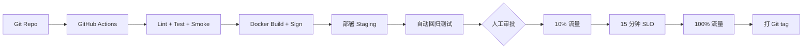

# CI/CD 与变更管理

## 目标

- **配置 YAML 化进 Git**：渠道、限速、计费、用户分组都进 Git，避免手改丢失
- **变更可审计**：谁改了什么、何时改、为什么改、回滚方法
- **基础设施即代码**：Ansible 一键起新机
- **灰度发布**：先 staging → canary → production，按 SLO 卡位

## 架构



## 文件结构

```
cicd/
├── .github/workflows/
│   ├── lint.yml             # PR 时跑
│   ├── deploy-staging.yml   # 合并到 main
│   └── deploy-prod.yml      # 手动触发 + 审批
├── ansible/
│   ├── inventories/
│   │   ├── staging.yml
│   │   └── production.yml
│   ├── playbooks/
│   │   ├── bootstrap.yml    # 新机初始化
│   │   ├── deploy.yml       # 部署 new-api
│   │   ├── rollback.yml     # 回滚
│   │   └── failover.yml     # 紧急切流
│   └── roles/
│       ├── common/          # SSH, fail2ban, ufw
│       ├── docker/
│       ├── new-api/
│       ├── caddy/
│       └── monitoring/
├── change-management/
│   ├── change-request.md    # 变更申请模板
│   ├── post-change.md       # 变更后 review
│   └── rollback.md          # 回滚 SOP
└── git-conventions.md       # 提交规范
```

## CI/CD Pipeline

### 触发器

| 事件 | 行为 | 环境 |
|---|---|---|
| Push to PR | lint + unit test + smoke | — |
| Merge to main | build + deploy staging + 回归测试 | staging |
| Tag `v*.*.*` | build + 提交生产部署审批 | prod (待审批) |
| Manual `workflow_dispatch` | 同上 | 任意 |

### 部署阶段

```
1. Build      （3-5 min）打 docker image，签名
2. Stage      （2 min）部署 staging
3. Smoke      （1 min）烟雾测试
4. Regression （5 min）回归测试
5. Approve    人工，最长 24h
6. Canary     部署 1 个 prod 实例（10% 流量）
7. Monitor    15 min，看 SLO
8. Full       全部 prod 实例
9. Verify     再跑一次 smoke
10. Tag       打 git tag + 推送 changelog
```

## 关键文件

- [`.github/workflows/lint.yml`](./.github/workflows/lint.yml) PR 检查
- [`.github/workflows/deploy-prod.yml`](./.github/workflows/deploy-prod.yml) 生产发布
- [`ansible/playbooks/bootstrap.yml`](./ansible/playbooks/bootstrap.yml) 新机初始化
- [`ansible/playbooks/deploy.yml`](./ansible/playbooks/deploy.yml) 升级部署
- [`ansible/playbooks/rollback.yml`](./ansible/playbooks/rollback.yml) 回滚
- [`change-management/change-request.md`](./change-management/change-request.md) 变更申请
- [`scripts/canary.sh`](./scripts/canary.sh) 灰度脚本
- [`scripts/rollback.sh`](./scripts/rollback.sh) 一键回滚

## 配置即代码

所有 new-api 配置（渠道 / 用户分组 / 限速 / 价格）都从 Git 同步：

```bash
# 把 deploy/channels/*.json 同步到 new-api DB
deploy/scripts/sync-channels-from-git.sh

# 把 deploy/billing/pricing.json 同步
deploy/billing/scripts/apply-pricing.sh

# 把 deploy/risk-control/limits.json 同步
deploy/risk-control/scripts/apply-defaults.sh
```

CI 在 deploy 阶段自动跑。

## 变更管理流程

| 类型 | 流程 |
|---|---|
| 配置变更（小）| Git PR → 1 个 reviewer → 合并自动部署 |
| 配置变更（影响价格 / 限速）| Git PR → 2 个 reviewer + 财务确认 → 灰度 |
| 代码变更 | Git PR → 1 个 reviewer + CI 全绿 → 灰度 |
| 数据库 schema | Git PR → DBA review → staging 演练 → 生产灰度 |
| 紧急 hotfix | 直接 push to `hotfix/*` → 部署 → 事后 review |

## 紧急回滚

```bash
# 一键回滚到上一个稳定 tag
./scripts/rollback.sh

# 等价于：
ansible-playbook -i inventories/production.yml playbooks/rollback.yml \
    -e "rollback_tag=v0.13.0"
```

详见 [`change-management/rollback.md`](./change-management/rollback.md)。
