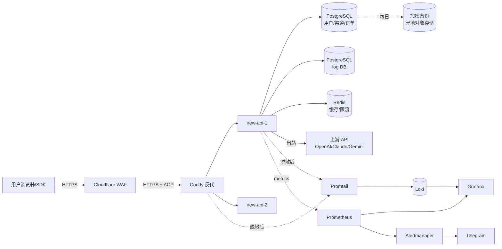

# 数据流向图

## 各点的 PII 暴露

| 点 | 数据 | PII 等级 | 防护 |
|---|---|---|---|
| 用户 → CF | 用户 IP / Token / Prompt | ★★★ | TLS 1.2+, HSTS, CF WAF |
| CF → Caddy | 同上 | ★★★ | TLS + AOP（Authenticated Origin Pulls）|
| Caddy → new-api | 同上 | ★★★ | 内网（127.0.0.1） |
| new-api → PG | 用户邮箱、订单号、IP、token 数 | ★★ | 内网；备份加密；DB 密码 |
| new-api → Logs PG | IP、token 数、模型名（不含 prompt 内容）| ★ | 同上 |
| new-api → Redis | 限流计数、session（hash）| ★ | 内网；密码 |
| new-api → Upstream | Prompt + Response（**真实数据**）| ★★★ | 上游协议 TLS + 我们不存 |
| 日志 (Promtail) | 已脱敏的 PII | ★ | 7 天 retention |
| 备份 | 全量 DB | ★★★ | AES-256 + 异地 |

## 关键流：用户调用 chat/completions

1. 用户带 Bearer Token 发请求
2. CF 做 WAF / Rate Limit / Bot 检查
3. Caddy 验证 AOP cert，转发到 new-api
4. new-api 校验 token（Redis 命中或查 PG）
5. new-api 选渠道（按 group + priority + weight）
6. new-api 把请求**原样转发**给上游（API key 替换为渠道的）
7. 流式响应转发回用户
8. 完成后 new-api 写一条 log 到 logs DB（**只元数据**：用户 ID / 渠道 / 模型 / token 数 / 耗时 / IP）
9. 扣费

**关键合规点**：
- 第 6/7 步：Prompt + Response 经过我们但**不落盘**（除非显式开 `LOG_PROMPT_ENABLED=true`）
- 第 8 步：log 中只有元数据，没有内容

## 上游再次传输的合规

OpenAI / Anthropic / Google 都是美国公司，用户数据会传到美国。

合规要求：
- 在隐私政策**明确告知**：使用本服务，您的 prompt 会被传给上游 AI 服务商（列出每家）
- 列出每家的隐私政策链接
- EU 用户：上游 SCCs 已签
- 中国用户（按法律）：网信办评估或本地化（实操不可能）

务实做法：在 ToS 里**明确告知用户责任** + 提供"国内模型分组"选项。
