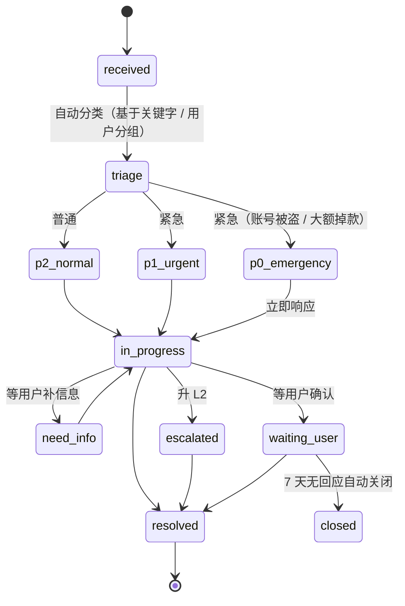

# L1 工单 SOP

## 工单生命周期



## 优先级与 SLA

| 级别 | 触发条件 | 首次响应 | 解决 SLA |
|---|---|---|---|
| P0 紧急 | 账号被盗 / 充值未到账金额 > $100 / 大额扣费异议 | **30 分钟** | **4 小时** |
| P1 高 | 服务不可用 / 401 大量发生 / 429 系统问题 | **2 小时** | **8 小时** |
| P2 普通 | 一般咨询 / 充值小问题 / 调用问题 | **24 小时** | **48 小时** |
| P3 低 | 功能建议 / 文档错别字 | **72 小时** | **下周期处理** |

> 付费用户优先于免费用户。VIP 用户 SLA 减半。

## 自动分类规则

```yaml
- if subject ~* "充值未到账|recharge.*not arrived"
  set: category=billing, priority=p1
- if subject ~* "401|unauthorized"
  set: category=auth, priority=p1
- if subject ~* "429|rate.*limit"
  set: category=quota, priority=p2
- if amount > 100 USD
  bump: priority=p0
- if user.group = "vip"
  bump: priority by 1 level (P3 → P2 etc.)
```

## 客服处理 SOP

### 1. 接单后第一件事：查用户

```sql
SELECT u.id, u.email, u.balance, u.group, u.created_at,
       COUNT(t.id) AS active_tokens,
       (SELECT COUNT(*) FROM logs WHERE user_id=u.id AND created_at > NOW() - INTERVAL '24 hours' AND status >= 400) AS recent_errors
FROM users u
LEFT JOIN tokens t ON t.user_id=u.id AND t.status=1
WHERE u.email='${user_email}'
GROUP BY u.id;
```

> 在 Chatwoot 里把这段做成"用户卡片"插件，鼠标悬停即显示。

### 2. 用 Canned Response

绝大部分场景有标准回复（[`canned-responses/`](./canned-responses/)）：
- 充值未到账 → `billing-not-arrived.md`
- 401 排查 → `auth-401-troubleshoot.md`
- 429 解释 → `quota-explained.md`
- 退款拒绝 → `refund-rejected-template.md`
- 退款批准 → `refund-approved.md`

### 3. 信息不全时

要求用户提供：
- 完整 request_id（每次响应 header 都有）
- 错误信息原文（截图）
- 调用代码（脱敏 API key）
- 时间（精确到秒，含时区）

模板见 `canned-responses/need-more-info.md`。

### 4. 解决后

- 改 status = `resolved`
- 加 internal note（解决步骤，便于复盘）
- 关单后自动发 CSAT 调查

## 关键禁忌

❌ **不要**直接说 "上游问题与我们无关"
❌ **不要**贴未脱敏的内部日志
❌ **不要**承诺超出退款政策的赔偿
❌ **不要**要求用户提供完整 API Key（只让看尾 4 位）
❌ **不要**直接执行用户索要的操作（如"删我所有数据"），先走身份核验流程

## 升级触发条件

立即升 L2：
- P0 工单 4 小时未解决
- 涉及多个用户的批量问题
- 涉及金额 > $500 的争议
- 用户威胁公开 / 法务 / 退款仲裁
- 你不确定"我说这话会不会被截图"

## 工具

- **Chatwoot**：主工单平台，集成邮箱 / Telegram / Web Widget
- **内部用户卡片**：浏览器插件，悬停邮箱显示用户简况
- **Canned Responses**：50+ 预存回复
- **SLA 监控**：Grafana 看板（每个客服的 SLA 达标率）

## 班次交接

每个班次结束发交接日志（Telegram 内部群）：

```
[早班 → 晚班] 2026-04-27
- 进行中工单 5 单（链接列表）
- 待用户回复 8 单
- 紧急关注：#1234（用户 alex 退款 $200，正等财务确认）
- 风险事件：上游 Anthropic 早 8 点抖动 30 分钟
- 客服反馈：FAQ 关于 USDT 充值的入口不清晰，建议改文案
```

## 培训

新客服上岗：
- D1：阅读 ToS / Privacy / Refund Policy / AUP
- D2：阅读所有 canned responses + 模拟回答 20 例
- D3：与老客服结对处理工单
- D4-7：独立处理 P3 工单（监督）
- W2 起：处理 P2 工单
- M2 起：处理 P1 工单

每月一次 session：复盘上月 Top 5 难处理工单。
