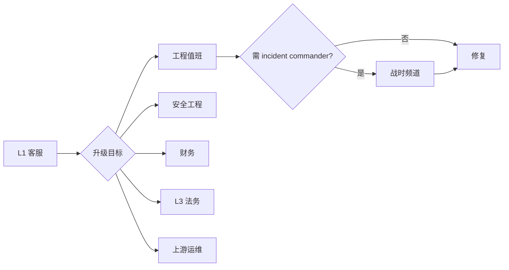

# L2 升级流程

## 何时升级

| 触发条件 | 升级目标 |
|---|---|
| P0 工单 4h 未解决 | 工程值班 |
| 影响 > 10 用户的批量问题 | 工程值班 |
| 涉及金额 > $500 的争议 | 工程值班 + 财务 |
| 用户威胁公开 / 法律 | L3 法务 |
| 数据安全事件 | L3 法务 + 安全工程 |
| 上游账户大批失效 | 上游运维 + 渠道运维 |
| 怀疑系统漏洞 | 安全工程 |

## 升级路径



## 升级动作清单

L1 客服在升级时**必须做**：
1. 在工单加 `internal_note` 记录现状
2. **不要**直接转手然后撒手 — 仍是工单 owner，需配合
3. 在 Telegram 内部群 `#l2-escalation` 发：
   ```
   [#1234][P0][billing] 用户 X 退款 $300 争议
   - 用户主张：充值后 5 分钟未到账
   - 我已查：订单状态 paid 但未自动入账，TXID 已确认
   - 升级原因：财务系统暂未支持自动补单
   - @财务-王 可否处理？
   ```
4. 工单状态改为 `escalated`，分配人改为升级目标

## 工程值班 onboarding

每位工程师轮值前必须熟悉：
- 客服后台基本操作（看工单 / 内部 note / 改状态）
- 主仓库的 incident response（[`sop/incident-response.md`](../sop/incident-response.md)）
- 退款 SOP（[`refund-policy.md`](../legal/refund-policy.md)）
- 上游运维 dashboard

## 升级会议

P0 / 大批量问题升级到 L2 后：

- 5 分钟内召集**战时会议**（Slack/Tencent Meeting）
- 角色：
  - **Incident Commander**：协调，决策
  - **Comms Lead**：对内对外沟通（用户公告、状态页）
  - **Tech Lead**：定位与修复
  - **Customer Lead**：处理工单与用户安抚

详见 [`sop/incident-response.md`](../sop/incident-response.md)。

## 决策树：是否升 L2？

```
Q1: 影响多少用户？
    1 人 → 留 L1
    2-10 人 → 看 Q2
    > 10 人 → 升 L2

Q2: 用户损失？
    < $50 → 留 L1
    $50-500 → 看 Q3
    > $500 → 升 L2

Q3: L1 5 分钟内能否解决？
    能 → 留 L1
    不能 → 升 L2
```

## 升级后的回流

L2 解决后：
1. 工程师在工单写 `resolution` 字段（解决方案 / 受影响范围 / 后续防范）
2. 转回 L1 关单（让 L1 用统一话术对外沟通）
3. 重大事件需写 RCA 报告（72h 内）
4. 周会 review，看是否能优化系统避免再发生

## 反向：L2 → L1

如果工程师发现升级是"误升"（例如 L1 忘记看 FAQ），要求：
- **不能直接打回**：会破坏客服信心
- **写明 misclassified 原因 + 教学**：把"对的处理流程"贴在工单内部 note
- 给 L1 主管发 Telegram，下次培训时讲

## 关键 KPI

- L2 工单数 / 总工单数 < 4%
- L2 工单平均处理时长 < 4h
- L2 工单转关单率 100%（不允许 L2 直接 ghost）
- 一个用户在 30 天内反复 L2 升级 ≥ 3 次：自动加入"VIP 关注名单"
