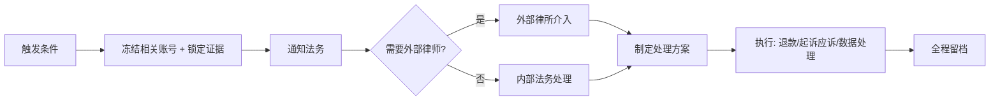

# L3 法务介入

## 触发条件（任一）

- 用户口头/书面威胁起诉、报警、监管投诉
- 用户在公开渠道（Twitter / 微博 / 黑猫投诉）发布负面内容并要求"立刻退款否则继续发"
- 用户提出 GDPR / CCPA / PIPL 数据权利请求
- 司法机关、警方、监管机关来函
- 涉及未成年人、CSAM、违法内容的投诉
- 涉及金额 > $5000 的争议
- 涉及 L1 / L2 客服可能存在过失或失误的事件
- 数据泄漏 / 安全事件外泄

## 流程



## 锁定证据（必做）

无论方案是什么，先做证据保全：

```sql
-- 把相关账号、订单、工单、日志做快照（防止后续修改）
INSERT INTO legal_snapshots (case_id, taken_at, snapshot)
SELECT '<case_id>', NOW(), jsonb_build_object(
    'user', (SELECT row_to_json(u) FROM users u WHERE u.id = $1),
    'orders', (SELECT json_agg(o) FROM orders o WHERE o.user_id = $1),
    'tickets', (SELECT json_agg(t) FROM tickets t WHERE t.user_id = $1),
    'logs_24h', (SELECT json_agg(l) FROM logs l WHERE l.user_id = $1 AND l.created_at > NOW() - INTERVAL '24 hours')
);
```

证据冻结存储不超过法定保留期（一般 7 年）。

## 处理类型

### A. 数据权利请求（DSR）

- GDPR / CCPA / PIPL：**30 天内**响应
- 处理流程见 [`compliance/user-data-request-sop.md`](../compliance/user-data-request-sop.md)
- 工具：[`compliance/scripts/user-export.sh`](../compliance/scripts/user-export.sh)

### B. 退款争议（金额大）

- L2 已尝试解决但用户不接受
- 法务评估：
  1. 是否符合 ToS / 退款政策
  2. 是否存在我方过失
  3. 风险/收益分析（继续争论 vs 退款止损）
- 决定后由 L1 用法务起草的话术回复

### C. 监管 / 司法机关来函

详见 [`legal/takedown-process.md`](../legal/takedown-process.md) 的"司法机关协助"部分。

### D. 公开舆情危机

涉及大 V 投诉、媒体报道：
1. 立即在内部群拉警报
2. **不要在公开渠道回应**（让法务起草）
3. 法务评估是否私下沟通解决
4. 必要时启用"统一对外口径"话术

## 外部律师对接

养护 1-2 家本地律所长期合作（按月给 retainer）：
- 国内主体：劳动法 / 网络法 / 经营违规
- 海外主体：当地律师 + 注册地公司法 + 数据合规
- 关键事件 24h 内能联系上

## 财务保留

法务介入的潜在大额事件，财务部要预留**专项准备金**：
- 单事件 > $1000 → 暂时冻结对应金额
- 解决后再释放

## 模板

详见 [`canned-responses/legal-`](./canned-responses/) 前缀的模板：
- `legal-acknowledge.md` 收到法律函的回执
- `legal-need-time.md` 请求延长响应时间
- `legal-not-applicable.md` 此事不属于 ToS 范围
- `legal-refund-no.md` 拒绝退款（含法律依据）
- `legal-refund-yes.md` 接受退款
- `dsr-receipt.md` 数据权利请求回执
