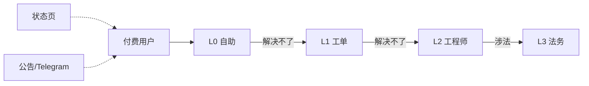

# 客服 / 工单 / 状态页 SOP

## 三层支撑



| 层级 | 工具 | 响应 SLA | 解决 SLA | 覆盖 |
|---|---|---|---|---|
| L0 自助 | FAQ + 文档 + 用量查询 | 实时 | 即时 | 70% 工单 |
| L1 客服 | Chatwoot / Crisp + 邮件 | 24h | 48h | 25% |
| L2 工程师 | Telegram / Linear | 8h（紧急 1h）| 72h | 4% |
| L3 法务 | 邮件 + 律师事务所 | 48h | 30d | < 1% |

## 文件清单

- [`L0-faq.md`](./L0-faq.md) FAQ + 自助工具清单
- [`L1-tickets.md`](./L1-tickets.md) 工单 SOP（含模板）
- [`L2-escalation.md`](./L2-escalation.md) 升级流程与决策树
- [`L3-legal.md`](./L3-legal.md) 法务介入触发条件与流程
- [`status-page.md`](./status-page.md) 状态页 + 公告 SOP
- [`canned-responses/`](./canned-responses/) 常用回复模板（25 篇）

## 工单系统选型

| 工具 | 价位 | 推荐度 | 说明 |
|---|---|---|---|
| **[Chatwoot](https://www.chatwoot.com)** | 自建免费 | ★★★★★ | 开源，多渠道 |
| Tawk.to | 免费 | ★★★ | 闭源，免费版广告 |
| Crisp | $25/月起 | ★★★★ | 商业版多渠道 |
| Zendesk | $19/月/坐席起 | ★★★ | 企业级但贵 |
| Discord 群 | 免费 | ★★ | 适合早期社区 |

> 推荐：**Chatwoot 自建**，整合邮箱 / Telegram / 站内 widget 三渠道，单一 inbox。

## Chatwoot 自建（5 分钟）

```bash
# docker-compose.chatwoot.yml
services:
  chatwoot:
    image: chatwoot/chatwoot:latest
    ports: ["3001:3000"]
    environment:
      - SECRET_KEY_BASE=GENERATE_ME
      - FRONTEND_URL=https://support.example.com
      - ENABLE_ACCOUNT_SIGNUP=false
      - REDIS_URL=redis://redis:6379
      - POSTGRES_HOST=postgres
      - POSTGRES_USERNAME=chatwoot
      - POSTGRES_PASSWORD=GENERATE_ME
    depends_on: [postgres, redis]
```

之后：
1. 加邮箱 inbox（IMAP 收 / SMTP 发）
2. 加 Telegram inbox（用 BotFather 拿 token）
3. 加站内 Widget（嵌入 new-api 用户中心右下角）
4. 配 SLA、自动回复、Canned Responses

## 客服排班

3 人小团队：
| 班次 | 时段（UTC+8）| 主备 | 工时 |
|---|---|---|---|
| 早 | 08:00-16:00 | 客服 A 主，B 备 | 8h |
| 晚 | 16:00-00:00 | 客服 B 主，C 备 | 8h |
| 夜 | 00:00-08:00 | 自动回复 + 紧急 oncall | 4h（仅紧急）|

## KPI

每月统计：
- 工单首次响应 SLA 达标率（目标 ≥ 95%）
- 工单解决 SLA 达标率（目标 ≥ 90%）
- CSAT（Customer Satisfaction，按工单关单后调查）目标 ≥ 4.5/5
- 工单总数、Top 5 类别、Top 5 复购原因
