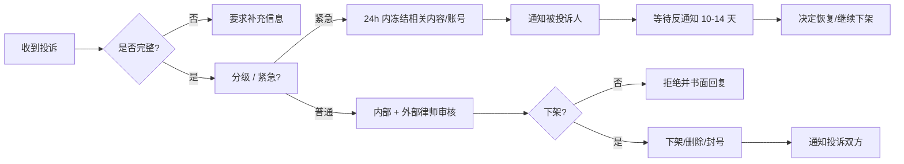

# 内容下架与争议处理流程

> 🚧 模板。Version: 1.0.0 / 2026-04-27
>
> DMCA 通知见 [`dmca.md`](./dmca.md)；其它（隐私、人格权、违法内容）走本文流程。

## 处理矩阵

| 类别 | 通知通道 | SLA | 法律依据 |
|---|---|---|---|
| 版权侵权（DMCA）| dmca@ | 7 工作日 | 17 USC §512 |
| 个人隐私 / 人肉 | privacy@ | 24h（高危）/ 7d | GDPR / CCPA / PIPL |
| 商标 / 不正当竞争 | legal@ | 7 工作日 | 各地商标法 |
| 仇恨言论 / 暴力 | abuse@ | 24h | 平台 AUP + 当地刑法 |
| CSAM | abuse@ + 警方 | 立即 | 强制报告 |
| 司法机关 / LEA | legal@ + 经核实身份 | 按法定期限 | 司法协助 |

## 通用流程

## 收件标准（拒绝模板）

收到投诉但不完整时，统一用以下文字回复（参考）：

> 您好，
>
> 感谢您的来信。为依法处理您的投诉，请补充以下信息：
> - 您的真实身份与权利证明（如版权登记证书、身份证扫描件等）
> - 被投诉内容的具体定位（请求 ID、用户 ID、URL）
> - 您主张的法律依据
> - 您的善意声明
>
> 收齐资料后我们将在 7 个工作日内回复处理结果。
>
> [[Legal Team]]

## 司法机关协助

接到正式法院令、传票、司法协助请求：

1. **核实身份与文件真伪**
   - 中国：通过法院公告系统核对案号
   - 美国：拨打法院或 LEA 主线核对（**不要**直接回拨来电）
2. **法律审核**：外部律师 24h 内出具是否合法的意见
3. **数据范围最小化**：只交付**明确指定**的数据，不交"可能相关"
4. **保留证据链**：所有交付材料 hash + 时间戳留档
5. **是否通知用户**：依法律要求决定（部分案件法律禁止通知用户）

## 删除前的备份

下架内容**必须保留 30 天**（加密备份），以备：
- 反通知后需要恢复
- 司法机关后续要求
- 我方诉讼证据

30 天后**永久删除**，证据保留 hash 即可。

## 模板邮件

参见 [`templates/`](./templates/)（按需扩展）：
- 收到通知确认（[[acknowledge.md]]）
- 要求补充材料（[[need-more-info.md]]）
- 通知被投诉用户（[[notify-target.md]]）
- 下架决定（[[takedown-decision.md]]）
- 拒绝下架（[[reject-decision.md]]）

## 内部记录

每次下架请求在 PG `legal_complaints` 表记录：
- complaint_id
- received_at
- complainant（投诉人）
- target_user_id
- target_request_ids[]
- category
- status（received / under_review / actioned / rejected / closed）
- decision_at
- evidence_path（对象存储）

季度复盘：
- 投诉响应 SLA 达标率
- 误下架率（被反通知成功撤回）
- 高频违规账号 → 是否进入 Repeat Infringer

---

**最后更新：2026-04-27**
**版本：v1.0.0**
