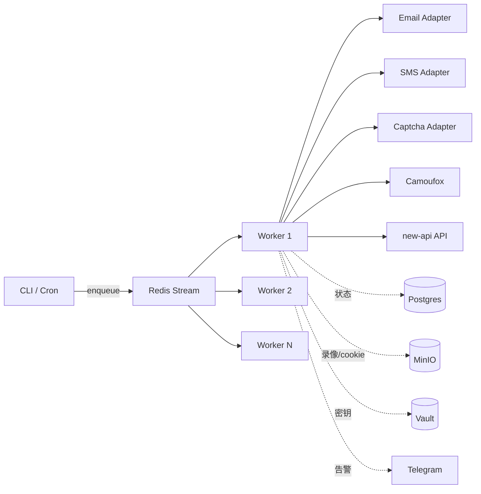

# 上游号池自动化流水线

> ⚠️ **法务红线**：自动化注册 + 接码 + 虚拟卡的组合可能违反**目标平台 ToS 与多国法律**。本目录仅作为技术参考，使用者**自行承担合规与法律责任**。强烈建议：
> - 流水线服务器、注册用 IP、收款主体、new-api 网关主体**完全分开**
> - 单平台一年内单 IP 不要超过若干次注册（按平台风控档位）
> - 优先用**官方付费 Key + Claude OAuth 半自动**，自动注册仅作为补充
> - 永远保留 30%+ 官方 Key 兜底，不能"号池为主"

## 设计原则

1. **完全独立的部署**：不和 new-api 在一台服务器，不和 new-api 共享 Docker 网络
2. **状态机驱动**：每个号一条 task，每步可恢复，全程录像
3. **异步无阻**：用 Redis Streams + Worker，单注册流程可并行 N 个
4. **预算硬限制**：单日花费上限超出强制停线
5. **可观测**：每步成功率 / 成本 / 失败原因 → Grafana
6. **可弃用**：当某 Recipe 失败率 > 30%，自动停掉

## 模块

| 模块 | 路径 | 说明 |
|---|---|---|
| 基础设施 | `docker-compose.upstream.yml` | Redis / Postgres / MinIO / Vault / orchestrator / workers |
| 编排器 | `orchestrator/` | 状态机 + worker pool + 恢复 |
| 邮箱 | `adapters/email/` | CF catch-all + IMAP + tempmail 三选一 |
| 接码 | `adapters/sms/` | sms-activate / 5sim 抽象 |
| 打码 | `adapters/captcha/` | CapSolver / 2Captcha 抽象 |
| 浏览器 | `browser/` | Camoufox + 住宅代理 |
| 预算 | `budget/` | 单日上限 + 报警 |
| Recipes | `recipes/` | 各平台具体 flow（Gemini / Claude）|

## 快速启动

```bash
cd deploy/upstream
cp .env.upstream.example .env.upstream
$EDITOR .env.upstream  # 填 Vault token / SMS API / CapSolver key / 代理凭证 / Telegram bot

docker compose -f docker-compose.upstream.yml --env-file .env.upstream up -d
docker exec upstream-orchestrator python -m orchestrator.cli init-db

# 提交一个注册任务（gemini）
docker exec upstream-orchestrator python -m orchestrator.cli submit --recipe gemini --count 5

# 看任务状态
docker exec upstream-orchestrator python -m orchestrator.cli list

# 看日志
docker logs -f upstream-orchestrator
docker logs -f upstream-worker-1
```

## 数据流



## 状态机

```
pending → email_ok → phone_ok → captcha_ok → registered → activated → key_extracted → imported → done
                                                                           ↓
                                                                        failed (任何步骤)
```

每个状态记录到 PG `tasks` 表，failed 时保留所有上下文供人工排查。

## 部署模式

| 模式 | 适用 | 注意 |
|---|---|---|
| 单机 docker compose | 测试 / 小规模 | 同 IP 注册风控会触发，仅本地测 |
| 独立 VPS + 住宅代理池 | 生产 | 推荐 |
| K8s Job + GPU node（多 Camoufox 实例）| 大规模 | 复杂，需要专人维护 |

## 子文档

- [`adapters/email/README.md`](./adapters/email/README.md)
- [`adapters/sms/README.md`](./adapters/sms/README.md)
- [`adapters/captcha/README.md`](./adapters/captcha/README.md)
- [`browser/README.md`](./browser/README.md)
- [`orchestrator/README.md`](./orchestrator/README.md)
- [`recipes/gemini/README.md`](./recipes/gemini/README.md)
- [`recipes/claude/README.md`](./recipes/claude/README.md)
- [`budget/README.md`](./budget/README.md)
- [`payment.md`](./payment.md)
