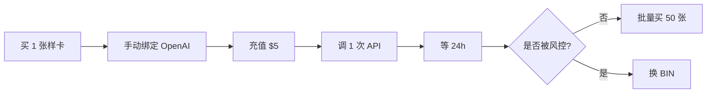

# 虚拟卡与支付链路（上游绑卡）

> ⚠️ 本目录是**上游绑卡**用的（给 Anthropic/OpenAI/Google 付钱），不是用户充值通道。
> 用户充值通道见 [`../../billing/`](../../billing/)。

## 目标

为 Claude / OpenAI / Google Workspace 等上游服务**自动化绑卡**提供：
- 卡源选型与 BIN 测试
- 一卡一号策略（避免连坐）
- 充值/续费 SOP
- 风控规避

## 主流方案对比（2026-Q2）

| 方案 | 单卡价格 | KYC | 通过率（OpenAI/Claude）| 推荐度 | 备注 |
|---|---|---|---|---|---|
| **OneKey Card** | $0.99 + 余额 | 钱包签名 | ★★★★ | ★★★★ | Mastercard, BIN 多变 |
| **Wildcard** | $4.99/月 | 美国 SSN/KYC | ★★★★★ | ★★★ | 通过率最高但 KYC 严 |
| **Bybit Card** | 免年费 | 交易所 KYC | ★★★ | ★★★★ | 适合中国用户 |
| **Yeschat Card** | $1 | 邮箱 | ★★★ | ★★★ | 部分 BIN 已封 |
| **dCard** | $5+ | 跳过 KYC | ★★ | ★★ | 价格波动 |
| **Visa 礼品卡** | 面值+10% | 现金购买 | ★★ | ★★ | 不能续费，一次性使用 |
| **国内副卡** | 0 | 实名 | 极低 | ❌ | 99% 拒付 |

> 💡 **默认推荐**：OneKey + Bybit 双源备份。OneKey BIN 多，便于绕开"同一 BIN 被封"风险。

## 一卡一号策略

每张虚拟卡只绑定**一个**上游账号：

```
account_alex_gmail_001  →  card_onekey_001
account_jordan_pm_002    →  card_onekey_002
account_taylor_zh_003    →  card_bybit_001
```

**原因**：
- 上游会基于卡号 + IP + 设备 + 邮箱组合做风控
- 同一卡绑两个号 → 第二个号大概率拒绑
- 一旦封一个，其它号不连坐

## BIN 测试 SOP

每批新卡先做 **BIN 测试**：

1. 从同批次取 1 张样卡
2. 按目标平台流程绑定（OpenAI / Claude）
3. 充值 $5 测试
4. 调一次 API 确认能扣费成功
5. **24 小时内不能被风控** → 该 BIN 可用
6. 通过后再批量买入 50 张



## 充值与续费

### 卡内余额管理（[balance-tracker.sh](./balance-tracker.sh)）

每张卡入库时记录：
- 卡号（脱敏：尾 4 位）→ Vault 存完整卡号
- BIN
- 入库余额
- 已扣金额（手动同步上游账单）
- 状态（active / locked / depleted）

每周对账：
- 余额低于 $5 自动告警
- depleted 卡批量提醒补充

### 续费 SOP

| 上游 | 续费周期 | 自动 / 手动 | 注意 |
|---|---|---|---|
| Claude Pro | 月付 $20 | 自动续 | 卡余额必须 $25+ |
| ChatGPT Plus | 月付 $20 | 自动续 | 部分 BIN 续不了，需换卡 |
| Google Workspace | 月付 $7.20 | 自动续 | OAuth scope 需求场景 |

## 风险与合规

⚠️ **重要警告**：

1. **绝大多数虚拟卡发卡机构 ToS 禁止"为他人代付/批量小额"**，规模化用可能触发 KYC 复审 → 卡被冻结
2. 在中国大陆境内"批量虚拟卡 + 帮人代付"可能被认定为**非法买卖外汇/逃汇**，金额大有刑事风险
3. 上游 ToS 几乎都禁止"账号倒卖与代付"，被识别可**永久封禁 + 资金冻结**
4. **强烈建议**：
   - 对外售卖只用**官方付费 API Key**（你买正规额度，转售合法）
   - 自动注册 + 绑卡的号池**仅用作内部成本优化**，**不要直接对外卖该号的算力**
   - 流水线服务器、注册 IP、收款主体、卡源**完全分开**

## 文件

- [`bin-test.md`](./bin-test.md) BIN 测试详细 SOP
- [`balance-tracker.sh`](./balance-tracker.sh) 卡余额追踪脚本
- [`vendor-list.md`](./vendor-list.md) 卡源对比与采购渠道
