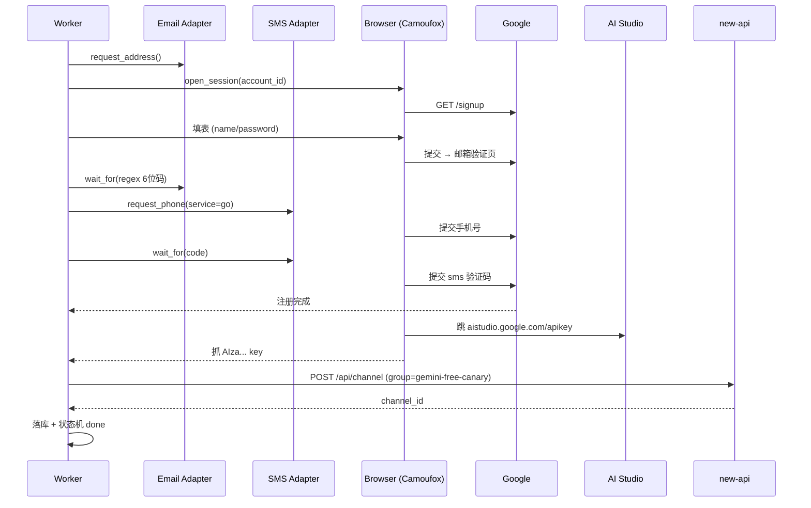

# Gemini Free Recipe

## 流程总览



## 容易踩的坑

| 现象 | 原因 | 解决 |
|---|---|---|
| 直接卡在"无法验证此手机号" | 接码平台号码已被滥用 | 换平台/换国家；用 Stable 号段 |
| 邮箱验证一直收不到 | catch-all 域名在 Google 黑名单 | 换备用域名；用 mail.tm 兜底 |
| AI Studio 一直转圈不出 Key | 账号被风控（限流） | 等 24h 再试；放弃此号 |
| 注册成功但 Key 调用 401 | 项目未启用 Gemini API | 在 Cloud Console 启用（已自动同意可省） |
| Captcha 反复出现 | IP 质量太差 / 短时间多次注册 | 换 IP / 换网段 |

## 测试单 Recipe

```bash
docker compose -f docker-compose.upstream.yml exec orchestrator \
    python -m orchestrator.cli submit gemini

# 实时日志
docker compose -f docker-compose.upstream.yml logs -f upstream-worker-1
```

## 选择器维护

Google 表单选择器随版本变化，建议：
- 每周用一台真实账号手动跑一遍流程，看是否有新版本
- 用 `data-testid` 选择器优先（比 css 类名稳定）
- 可考虑用 LLM 来识别页面元素（OpenAI / Claude vision），robustness 更高
